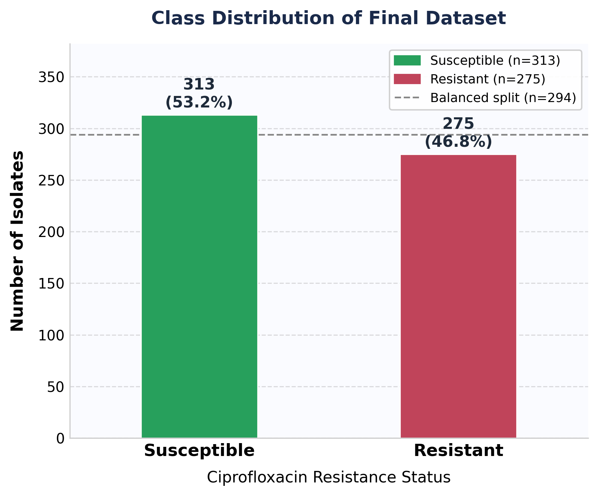
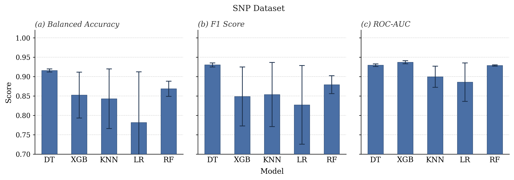
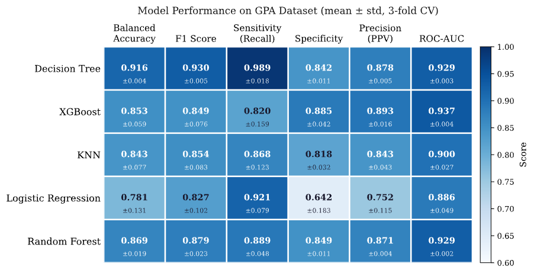
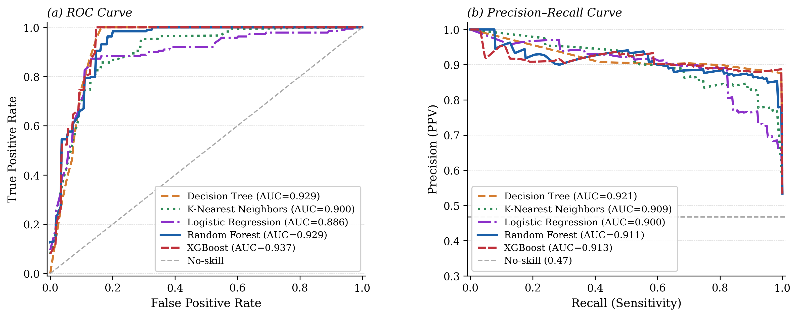
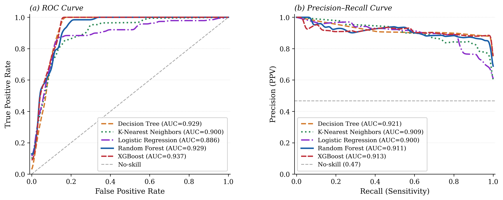
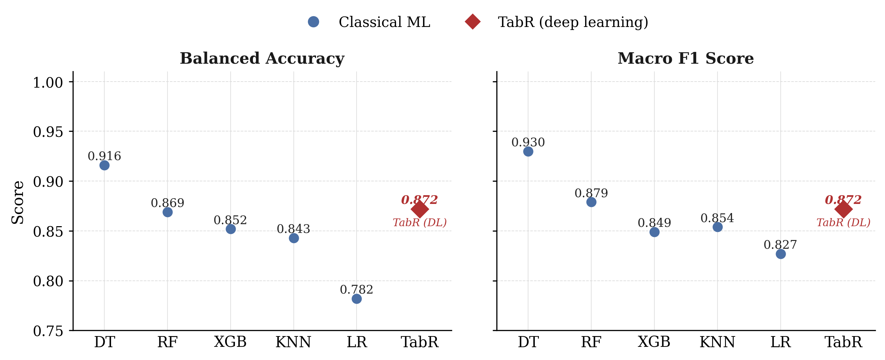
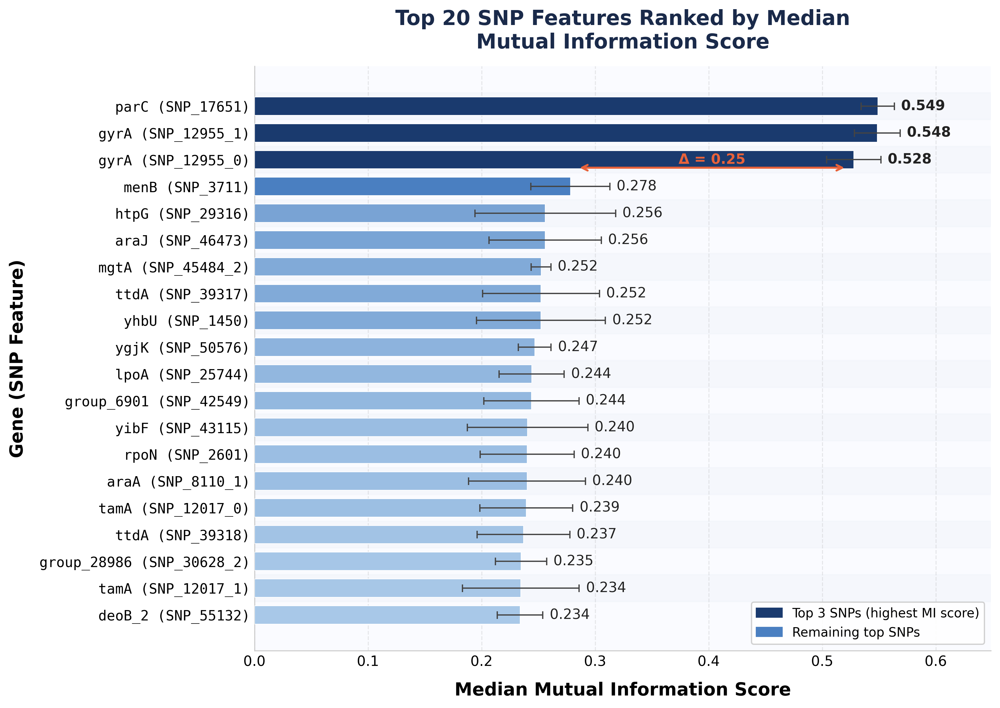
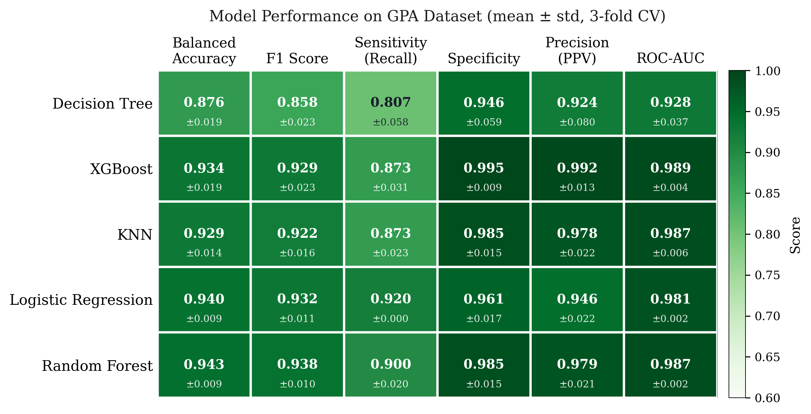
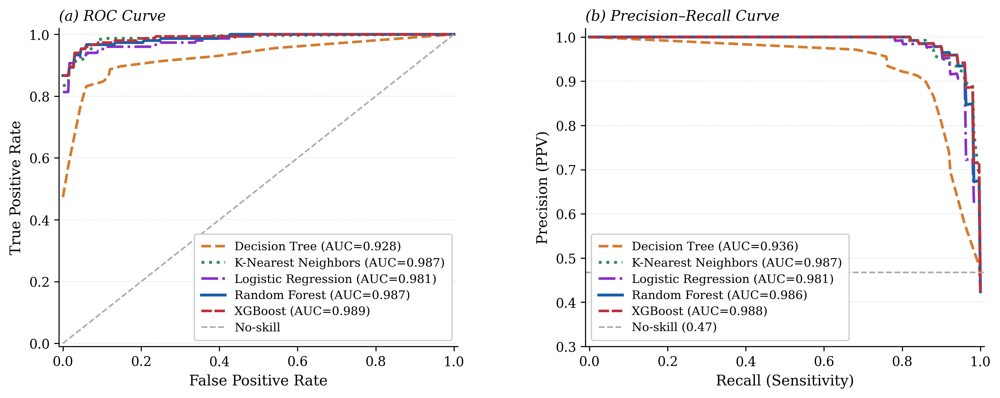
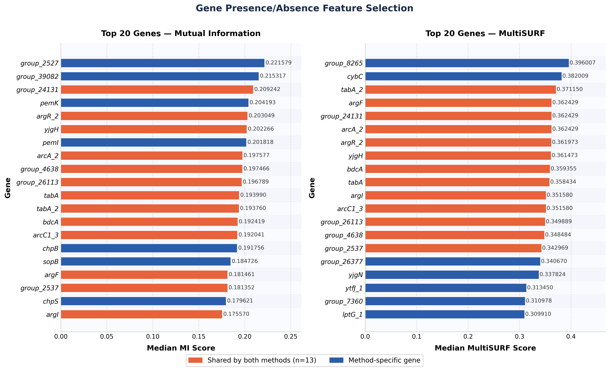

# Predicting Antibiotic Resistance in *E. coli* Using Machine Learning and Deep Learning

MS Thesis — San Francisco State University, 2026
**Abdoul Abdillahi**

---

## Overview

This repository contains the full code, pipeline, and results for my master's thesis on predicting ciprofloxacin resistance in *Escherichia coli* from whole-genome sequencing data. The study benchmarks five classical machine learning models and one deep learning model (TabR) across two genomic feature representations: Single Nucleotide Polymorphisms (SNPs) and Gene Presence/Absence (GPA).

The full thesis is available at: [`Abdoul_Abdillahi_MS_Thesis_2026.pdf`](./Abdoul_Abdillahi_MS_Thesis_2026.pdf)

---

## Research Aims

1. Construct feature matrices based on SNPs and GPA from a pangenome analysis of 588 *E. coli* genomes
2. Benchmark five traditional ML models and one deep learning model on both feature sets for predicting ciprofloxacin resistance
3. Evaluate the influence of feature representation and model selection on predictive performance and biological interpretability in genomic AMR prediction

---

## Dataset



- **600** clinical *E. coli* isolates from three published studies:
  - Invasive *E. coli* in England
  - The NORM surveillance programme in Norway
  - A US military healthcare network
- All isolates derived from human bloodstream infections (bacteraemia)
- Whole-genome sequences retrieved from **NCBI** and **ENA** public databases
- Resistance labels determined by **EUCAST** clinical breakpoints for ciprofloxacin
- **588 matched isolates** used after quality control (470 train / 118 test)

### Feature Engineering

| Statistic | SNP Features | GPA Features |
|-----------|-------------|-------------|
| Initial features | 166,415 variants | 6,092 genes |
| After quality filtering | 56,717 variants | 3,625 genes |
| After one-hot encoding | 67,259 features | — |
| After feature selection | 42,178 (MI) | 2,946 (MI + MultiSURF) |

---

## Methods

### Classical ML Pipeline (STREAMLINE)
- **Models:** Decision Tree (DT), K-Nearest Neighbours (KNN), Logistic Regression (LR), Random Forest (RF), XGBoost (XGB)
- **Cross-validation:** 3-fold CV on training set
- **Feature selection:** Mutual Information (SNP) · MI + MultiSURF (GPA)
- **Pipeline:** Modified STREAMLINE (see `pipeline/`)

### Deep Learning (TabR)
- Transformer-based model designed for tabular data
- Trained on same train/test splits as classical models
- Modified TabR implementation (see `dl_tabular/src/`)


---

## Results

### SNP Dataset (n = 118 test isolates)

| Model | Balanced Acc. | F1 Score | ROC-AUC |
|-------|:---:|:---:|:---:|
| **Decision Tree** | **0.916** | **0.930** | 0.929 |
| Random Forest | 0.869 | 0.879 | 0.929 |
| XGBoost | 0.852 | 0.849 | **0.937** |
| K-Nearest Neighbours | 0.843 | 0.854 | 0.900 |
| Logistic Regression | 0.782 | 0.827 | 0.886 |
| TabR (deep learning) | 0.872 | 0.872 | 0.926 |

### Gene Presence/Absence Dataset (n = 118 test isolates)

| Model | Balanced Acc. | F1 Score | ROC-AUC |
|-------|:---:|:---:|:---:|
| **Random Forest** | **0.943** | **0.937** | 0.987 |
| Logistic Regression | 0.940 | 0.933 | 0.981 |
| XGBoost | 0.934 | 0.929 | **0.989** |
| K-Nearest Neighbours | 0.929 | 0.922 | 0.987 |
| Decision Tree | 0.876 | 0.858 | 0.928 |
| TabR (deep learning) | 0.925 | 0.930 | 0.974 |


### SNP — Cross-Validation Performance (3-fold CV)





### SNP — ROC & Precision-Recall Curves (Training)



### SNP — ROC & Precision-Recall Curves (Test Set)



### SNP — Classical ML vs TabR (Test Set)



### SNP — Top 20 Features by Mutual Information *(gyrA and parC dominate)*



### GPA — Cross-Validation Performance (3-fold CV)


### GPA — Test Set Performance



### GPA — ROC & Precision-Recall Curves (Training)



### GPA — ROC & Precision-Recall Curves (Test Set)


### GPA — Top 20 Genes by MI and MultiSURF



### Key Findings
- GPA features yielded consistently higher performance than SNP features across all models
- Classical ML outperformed TabR on both datasets under the current experimental conditions
- Ensemble methods (RF, XGB) dominated on GPA; localized non-linear rules (DT) performed best on SNP
- XGBoost achieved the highest ROC-AUC on both datasets (SNP: 0.937, GPA: 0.989)
- TabR remained competitive, ranking above several classical models on the GPA dataset
- Top SNP features confirm known biology: *gyrA* and *parC* mutations are the primary drivers of ciprofloxacin resistance

---

## Repository Structure

```
antibiotic-resistance-ml/
├── Abdoul_Abdillahi_MS_Thesis_2026.pdf          # Full thesis
├── pipeline/                                     # Modified STREAMLINE ML pipeline
│   ├── run.py                                    # Main entry point
│   ├── run_configs/                              # Experiment configs (SNP & GPA)
│   └── streamline/                              # Pipeline source code
│       ├── dataprep/                            # Data processing & k-fold splitting
│       ├── featurefns/                          # Feature selection (MI, MultiSURF)
│       ├── modeling/                            # Model training & hyperparameter tuning
│       ├── models/                              # DT, RF, XGB, LR, KNN implementations
│       ├── postanalysis/                        # Report generation & statistics
│       ├── runners/                             # Pipeline step runners
│       └── utils/                              # Utilities
├── dl_tabular/                                  # TabR deep learning
│   ├── src/                                     # Modified TabR source code
│   │   ├── bin/tabr.py                         # Main training script
│   │   └── lib/                               # Library modules
│   └── experiments/                            # Experiment configs & results
│       ├── configs/                            # gen_pa.toml, snp.toml
│       └── results/                           # report.json, summary.json
├── ml_gene_presence_absence/                   # GPA experiment
│   ├── configs/gene_presence.cfg
│   ├── notebooks/
│   ├── reports/                               # STREAMLINE PDF reports
│   └── results/
│       ├── exploratory/
│       ├── feature_selection/
│       └── model_evaluation/
│           ├── training/
│           └── replication/
├── ml_single_nucleotide_polymorphism/          # SNP experiment
│   ├── configs/SNP.cfg
│   ├── notebooks/
│   ├── reports/                               # STREAMLINE PDF reports
│   └── results/
│       ├── exploratory/
│       ├── feature_selection/
│       └── model_evaluation/
│           ├── training/
│           └── replication/
└── tools/                                      # External tools documentation
```

---

## Environment Setup

### Classical ML (STREAMLINE)
```bash
cd pipeline
pip install -r requirements.txt
python run.py --config run_configs/SNP.cfg
python run.py --config run_configs/gene_presence.cfg
```

### Deep Learning (TabR)
```bash
cd dl_tabular/src
conda env create -f environment.yaml
conda activate tabr
python bin/tabr.py --config ../experiments/configs/snp.toml
python bin/tabr.py --config ../experiments/configs/gen_pa.toml
```

> **Note:** Experiments were run on the SFSU HPC cluster. Raw genomic data is not included in this repository due to size. Data can be retrieved from NCBI and ENA using accession numbers referenced in the thesis.

---

## External Tools

- **STREAMLINE** — [UrbsLab/STREAMLINE](https://github.com/UrbsLab/STREAMLINE) (modified)
- **TabR** — [yandex-research/tabular-dl-tabr](https://github.com/yandex-research/tabular-dl-tabr) (modified)

---

## Citation

If you use this work, please cite:

> Abdillahi, A. (2026). *Predicting Ciprofloxacin Resistance in Escherichia coli Using Machine Learning and Deep Learning on Pangenomic Features*. MS Thesis, San Francisco State University.
